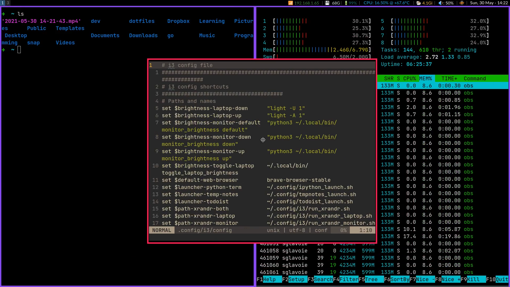

# Dotfiles – The bare way

This dotfiles management setup came to life thanks to the article [The best way to store your dotfiles: A bare Git repository](https://www.atlassian.com/git/tutorials/dotfiles). I've wrote a summary of it [on my website](https://www.sglavoie.com/posts/2021/05/30/managing-dotfiles-with-git-bare-repository/) as a (self-)reference.

## What's in it for me?

Hopefully, a little inspiration. Besides that, I store configuration files for the main pieces of software I use, notably:

* Bash aliases;
* Git;
* [i3 tiling window manager](https://github.com/i3/i3) with [i3blocks](https://github.com/vivien/i3blocks/);
* Kitty terminal;
* [Scripts](.local/bin) to manage microphone output, monitor brightness, system packages and so on;
* Zsh with [ohmyzsh](https://github.com/ohmyzsh/ohmyzsh).

### Demo

## Acknowledgements

* Thanks to [Derek Taylor](https://gitlab.com/dwt1/dotfiles) for having shared his knowledge in [this YouTube video](https://www.youtube.com/watch?v=tBoLDpTWVOM).
* Thanks to [@ankush](https://github.com/ankush/dotfiles) for sharing his own setup, from which I've learnt a couple of useful things!
